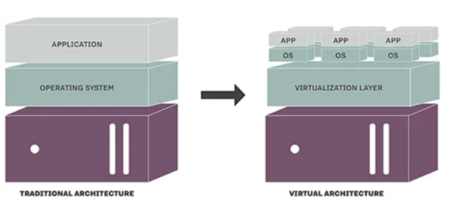
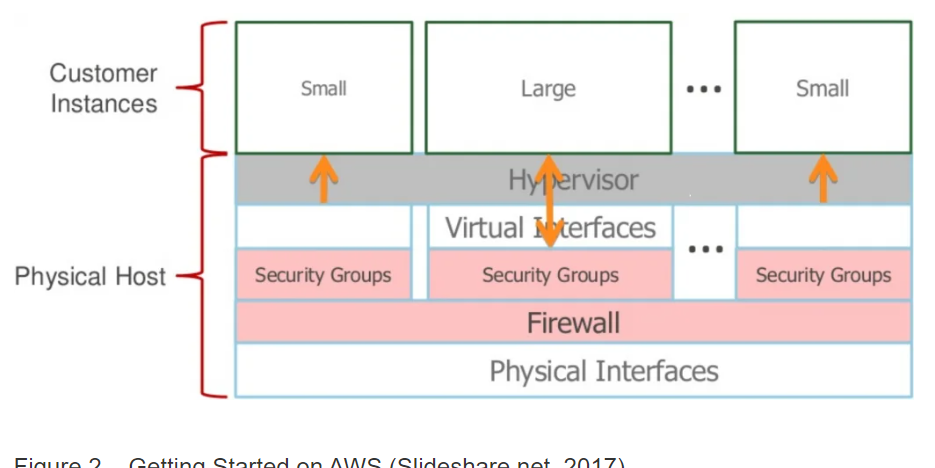

# Questions?

**How has virtualization evolved beyond desktops and servers?**

VMWare was introduced to cheap Intel hardware which made it easier for people to virtualize a computer

**In the context of the Amazon IaaS Cloud Service Model, what does EC2 stand for?**

Amazon Elastic Compute Cloud

**What types of storage does EC2 use, and how is EC2 web traffic managed?**

Ephemeral (temp) or Elastic Block Storage which are stored in Amazon S3

**What are the benefits of service-oriented architecture for customers of EC2 virtualized services?**

It has the ability to control virtualization through web interface and manage entire systems through API

**Analyze how cloud virtualization can promote equitable access to technology resources across diverse populations. How can this technology bridge cultural gaps and empower underserved communities?**

Cloud virtualization is very accessible and can reach underserved communities where they do not have the physical infrastructure 

# Notes

Virtualization can be dated to 1960, but VMWare popularize in 1999

Traditional vs Virtual

Amazon Elastic Compute Cloud (EC2) is based on Xen hypervisor that provides virtual servers

Amazon Machine Image(AMI) is a virtual appliance that creates on-demand virtual machines with EC2

###### Images pulled from (https://www.joe0.com/2017/06/11/importance-of-virtualization-in-the-amazon-ec2-cloud/)

# Bookmarks

[Amazon EC2 Cloud](https://www.joe0.com/2017/06/11/importance-of-virtualization-in-the-amazon-ec2-cloud/)

