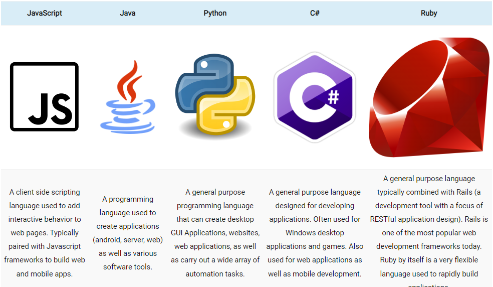

PowerShell is a powerful script language used for automating task and widely used today

# Questions?

**What is the difference between Bash and PowerShell?**

Bash works with strings and PowerShell works with objects

**In what scenarios or environments can you use PowerShell? Name some major platforms where PowerShell is supported.**

PowerShell can be used by Systems Administrator, Systems Engineer, and Network Administrator. Windows, Linux, and AWS are some platforms where PowerShell is supported. 

**List at least three reasons why learning PowerShell could be beneficial for your career and environment.**

PowerShell can make you faster as it provides automation. It has a great community and help you become better. Also it is growing and being adopted, so it will help you be competitive in the job market. 

**How can PowerShell’s automation capabilities improve efficiency and reduce manual errors?**

PowerShell can conduct test of outcomes and makes sure its accurate for every initiative. 

**Think about a situation where you might use PowerShell in your everyday life or job. How could PowerShell help you accomplish a specific task or solve a problem?**

I can probably use PowerShell to organize files I have on my computer, so I can go to certain folders for all the same thing I am looking for. Instead of having to always search for it

# Notes

 PowerShell is a command-line shell interface made by Microsoft that enables system administrators and power users to manage computers from the command line.

 

Power shell language comparison (https://www.techthoughts.info/ps1-should-you-learn-powershell/)

Top 5 reasons to PowerShell

1. Automation
2. Accuracy
3. Versatility
4. Community
5. Relevant

PowerShell used for automation and configuration management
Works with Objects
Scripts share complex data, passing entire data objects between commands

# Things I Want to Know

What are the cons of PowerShell?

What specific things can I do with PowerShell?

# Bookmarks

[Should You Learn PowerShell](https://www.techthoughts.info/ps1-should-you-learn-powershell/)

[Who Needs Malware?](https://www.techthoughts.info/ps1-should-you-learn-powershell/)

[What Is PowerShell](https://learn.microsoft.com/en-us/powershell/scripting/overview?view=powershell-7.3&viewFallbackFrom=powershell-7)

[PowerShell Getting Started](https://learn.microsoft.com/en-us/powershell/scripting/learn/ps101/01-getting-started?view=powershell-7.3&viewFallbackFrom=powershell-7)

[PowerShell Variables and Operators](https://ss64.com/ps/syntax-variables.html)
