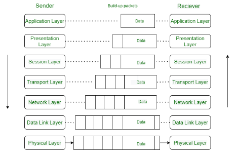

# Questions?

**1. What does “OSI” stand for?**

Open System Interconnection

**2. List the 7 layers of the OSI model and what each one is responsible for.**

1. Physical- Establishes physical connections between devices
2. Data Link - Node to node delivery of message
3. Network - Transmitting data from one host to another on different networks
4. Transport - Take service from network layer and sends it to application layer
5. Session - Establishes connection, maintenance,, ensures authentication and security
6. Presentation - Data from application layer is extracted and manipulated into required format for transmission
7. Application- Helps in identifying the client and synchronizing communication

**3. Distinguish which layers are the “hardware layers”, and which layers are the “software layers”. What does that even mean?**

Layer 1 and 2 are the hardware layers while the rest are software layers. This means that these two layers actually have a physical components in them like cables and NICs. The software layers deals exactly with what it says, software related function like routing packets and software protocols. 

**4. How can the OSI model be used in troubleshooting?**

Each layer has its own function which means you can isolate the problem and come with a solution from there. You can easily check each layer and go from there. 

**5. What is Wireshark?**

It is a tool for network troubleshooting that does Packet Capture, Filtering, and Visualization.

**6. What is a packet?**

A packet is a unit of data in networking. It contains the actual data bein transmitted and control information for router and error-checking. 

**7. What 3 high-level things does Wireshark accomplish? How could these be used for nefarious purposes? For benevolent purposes?**

Packet Capture -Can be used for data theft and network troubleshooting

Filtering - Can focus on a certain type of traffic targeting vulnerabilities and help in troubleshooting by narrowing down captured data

Visualization - Can be used for social engineering and anomaly detection to detect unusual patterns

# Notes

OSI- Open Systems Interconnection which was developed by ISO (International Organization for Standardization) in 1984

7-layers which has its own functionality to work together to transmit data from one person to across the globe

1. Physical Layer

The physical layer is the lowest layer and responsible for the physical connection between devices. It contains bits (information) and transmits individual bits from one node to the next. 

2. Data Link Layer

The data link layer handles node-to-node delivery of the message. It ensures it is data transfer is error free over the physical layer. DLL is divide into LLC (Logical Link Control) and MAC (Media Access Control)

3. Network Layer

The network layer transmit data from on host to different networks. It takes care of packet routing. The sender and receiver's IP addresses are placed in the header by the network layer. 

4. Transport Layer

THe transport layer provides services for the application layter and takes from the network layer. Data in this layer is called Segments. It provides acknowledgement of successful data transfer and re-transmits.

5. Session Layer

The session layer establishes connections, maintenance of sessions and authentication, and ensures security

6. Presentation Layer

Data from the application layer is extracted here and formatted to transmit over the network. It is also called the Translation layer

7. Application Layer

The application layer produces the data which has to be transferred over the network. It displays the received information to the user.

Wireshark captures network packets and display them at a granular level. 

The packets can be broken down and use in real-time or offline analysis

It can identify root causes, assist with network analysis, and network security

## Bookmarks

[OSI Model](https://www.geeksforgeeks.org/open-systems-interconnection-model-osi/)

[Wireshark](https://www.comptia.org/content/articles/what-is-wireshark-and-how-to-use-it#myself)

[Understanding OSI Model](https://www.professormesser.com/network-plus/n10-008/n10-008-video/understanding-the-osi-model-3/)

[Data Communication](https://www.professormesser.com/network-plus/n10-008/n10-008-video/data-communication/)