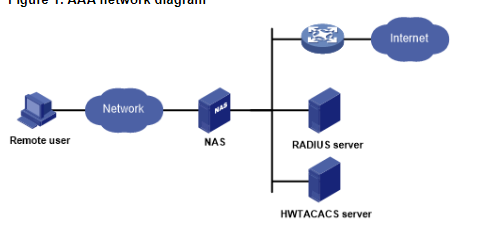

#[AAA](https://www.geeksforgeeks.org/computer-network-aaa-authentication-authorization-and-accounting/)

**1. Explain each of the three A’s as you would to a non-technical family member. Use an analogy or a story.**

Authentication- When entering a military base, you have to show them your CAC card (ID) to be allow on base. 

Authorization- Once you are allowed in the base, there are certain areas on base where you cannot get into unless you are authorize. You will need further permissions like other forms of ids or you have to be on a list to gain access to certain areas on base. 

Accounting- For the controlled access areas on base, you may get logged into a book as to why you are visiting the area. They will logged the time you checked in and checked out. This ensures they know who enter it at what time and how long they were there. 

**2. What should the administrator do if the ACS server fails to authenticate a user during AAA implementation?**

The administrator should mention using the local database of the device as a backup, in the method list, to implement AAA.

**3. What is the role of the NAS in the AAA implementation using an ACS server? Use a diagram.**

The client or Network Access Server (NAS) sends authentication requests to the ACS server and the server takes the decision to allow the user to access the network resource or not according to the credentials provided by the user. 

[RADIUS](https://archive.is/27Y19)

**1. What are the benefits of using RADIUS for authentication and authorization?**

It allows remote access to servers to communicate with a central server to authenticate dial-in users and authorize their access to the requested system or service

**2. What is RADIUS and what does it stand for?**

Remote Authentication Dial-In User Service 

**3. Research: What encryption algorithms does RADIUS use?**

RADIUS uses MD5 XORING