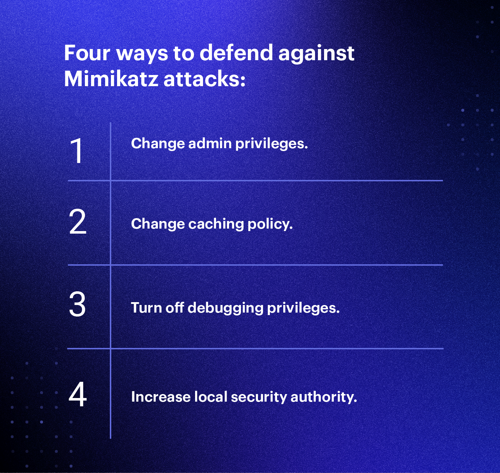

[What is Mimikatz? ](https://www.varonis.com/blog/what-is-mimikatz)

# Questions?

Name the six credential-gathering techniques which Mimikatz is able to perform and explain how two of them work.

**1. Pass-the-hash- Attackers can use Mimikatz to pass the exact has string to the target computer to log in.**

Pass-the-ticket- Similar to pass-the-hash, Mimikatz provides functionality for a user to pass a Kerberos ticket to another computer and log in with that user’s ticket

**2. What are four ways we can defend against Mimikatz attacks. Explain how two of the mitigations can stop Mimikatz.**

Limiting admin privileges' to only users who need them will limit how many accounts Mimikatz can target. 

By disabling password-caching, Mimkatz won't be able to gain access to the cache passwords. 