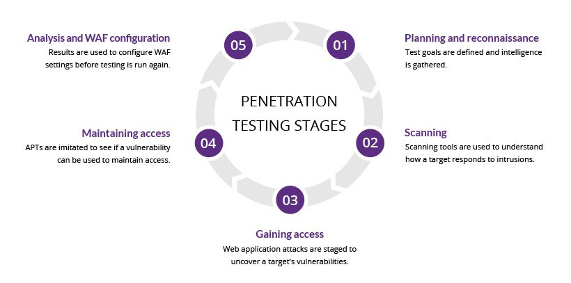
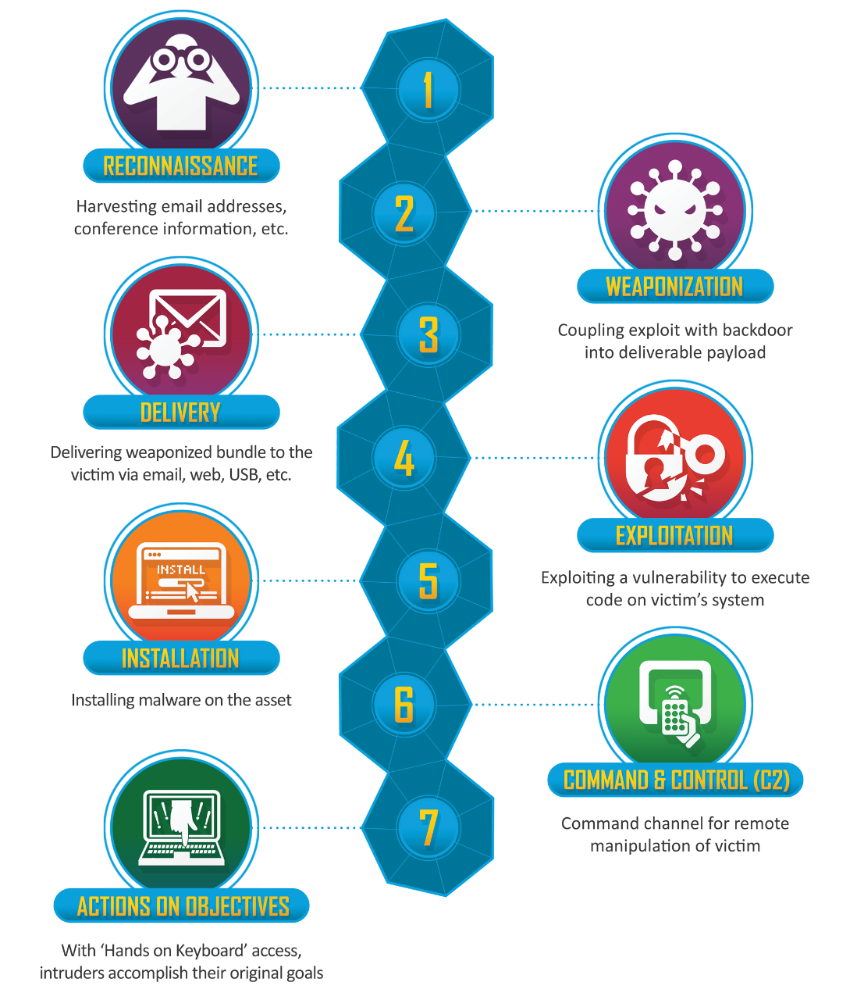

[https://www.imperva.com/learn/application-security/penetration-testing/]()

# Questions?

**1. How are the stages of a pen test very similar to those of the Cyber Kill Chain?**

**2. Your manager has asked you to explain the benefits of a pentest to the company’s leadership. How would you lead this conversation?**

Pentesting is crucial for finding vulnerabilities. By simulating attacks on our system, we can reduce risks and identify weak spots. 